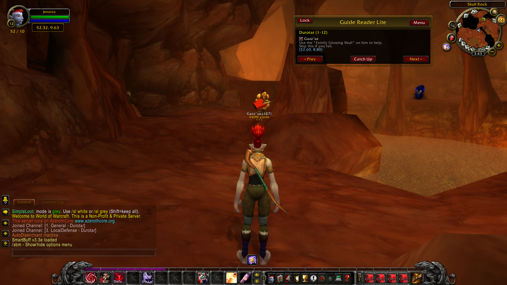

  
   
  <em>In-game screenshot of GuideReaderLite</em>

# GuideReaderLite

**GuideReaderLite** is a free, lightweight in-game leveling guide reader for **World of Warcraft: Wrath of the Lich King (3.3.5a)**.  
Supports **all classes, 1–80**, designed primarily for private server players.

---

## Features
- Step-by-step questing routes with map coordinates
- Compatible with addons like **TomTom** for waypoints
- Alliance, Horde, and Neutral support
- Simple, no-frills design

---

## Installation
1. Download this repository as a `.zip` or clone it with Git.  
2. Extract to your WoW `Interface/AddOns/` folder.  
3. Launch WoW and enable **GuideReaderLite** in the AddOns menu.  

---

## Notes
This addon was **written entirely from scratch**, though some design influence came from classic addons such as *TourGuide*.  
It’s my own work, but I’m giving credit where inspiration is due.

---

## Why I Built This
I created GuideReaderLite partly as a way to teach myself Lua, even if the language feels dated today. At the same time, I noticed there weren’t many strong leveling guides left for the original 3.3.5a era, so I decided to revive the quest routes I had written years ago and give them a proper addon home. I also don’t play retail anymore after twenty years, and with how different modern Lua coding has become, I wasn’t interested in rewriting everything. This project is built purely for private servers, to keep the WotLK experience alive in the way I still enjoy it.

---

## Disclaimer
This addon is built for educational and nostalgic use on **WotLK 3.3.5a private servers**.  
It is **not affiliated with Blizzard Entertainment** and currently **not designed for retail WoW**.

---

## License
## License
- **Addon code (Lua):** Released under the [GNU General Public License v3.0 (GPLv3)](https://www.gnu.org/licenses/gpl-3.0).  
  This ensures the code stays open-source and improvements remain shareable.  

- **Guide content:** Provided for personal and educational use.  
  Some portions are based on older community guides that are no longer available.  
  As these are heavily modified and still evolving, no formal license is applied yet.
  
  
---

## TODO:
- **Classes** Currently these are not done, but I do have them in place, I route and test my guide with a priest. But once I am happy with all the new updates I will go back and clean up the classes.   
- **Arrow GPS** NPC's are done and spot on, objectives are W.I.P. Use map for now to locations.
- **TAGS** Some tags are goofy, as I am experimenting with them, but should work for the most part.
- **RETAIL VERSION** YES! I plan on making a retails version of GRL. FREE! Will do this one all the bugs are worked out. And only will be WOTLK only.

